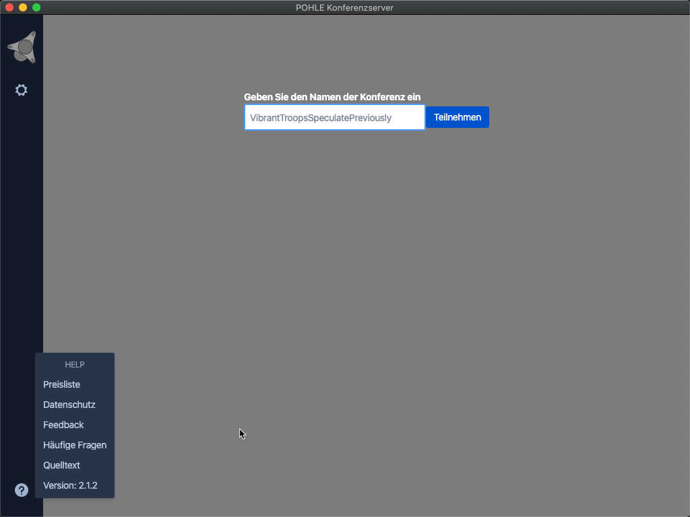

# POHLE Konferenzserver App für MacOS und Windows

Desktopanwendung für den [POHLE Konferenzserver] für Windows und MacOS. 

## Funktionen

- Fork des jitsi-meet-electron Client
- Soweit möglich auf Deutsch übersetzt
- Für meinen Konferenzserver angepaßt (Titel, Logos, Farben, ServerURL)
- Die Anwendung kann natürlich mit jedem anderen [Jitsi Meet] Server verwendet werden
- Lokal gespeicherte Settings
- Automatische Updates
- Fernsteuerung
- Kleines Extrafenster, wenn die App nicht den Fokus hat
- Signierte App für MacOS und Windows
- Initiales Fenster vergrößert

## Installation

Für den [POHLE Konferenzserver] brauchst Du ein Konto, damit Du Konferenzen starten kannst. Um an Konferenzen teilzunehmen brauchst Du nur den Namen der Konferenz und ggf. das Kennwort für die Konferenz, aber kein Konto. 

Für Windows gibt es das [Windows Setup EXE] zum einfach installieren  (für die meisten Anwender empfohlen) und als [Windows Setup MSI] für Administratoren, die das Program automatisch auf die Arbeitsstationen installieren möchten .

Für MacOS gibt es ein DMG File zum Download, dieses einfach mounten und die App ins Applications Verzeichnis ziehen, wie Ihr das von anderen MacApps gewohnt seid: [MacOS Setup]

## Weitere Informationen

Weitere Informationen zum [POHLE Konferenzserver]

## Lizenz

Apache 2. Siehe in der [LICENSE] Datei.

## Community

Jitsi ist von einer großen Gemenschaft von Entwicklern gebaut, wenn Du teilnehmen 
möchtest, registriere Dich im [community forum].

[Download]: https://github.com/cpohle/jitsi-meet-electron/releases/latest
[community forum]: https://community.jitsi.org/
[LICENSE]: LICENSE
[POHLE Konferenzserver]: https://support.pohle.net/display/HC/Konferenzserver
[Jitsi Meet]: https://jitsi.org/jitsi-meet/
[Windows Setup EXE]: https://github.com/cpohle/jitsi-meet-electron/releases/download/v2.1.0/POHLE.Konferenzserver.Setup.2.1.0.exe
[Windows Setup MSI]: https://github.com/cpohle/jitsi-meet-electron/releases/download/v2.1.0/POHLE.Konferenzserver.2.1.0.msi 
[MacOS Setup]: https://github.com/cpohle/jitsi-meet-electron/releases/download/v2.1.1/POHLE.Konferenzserver.Setup.2.1.1.dmg
